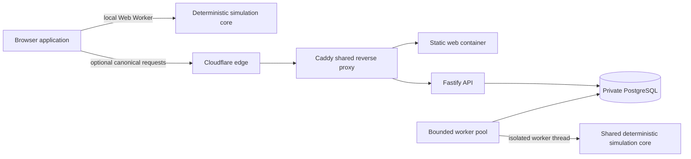

# SystemForge production architecture

SystemForge is deliberately split into a browser-local data plane and a bounded canonical control plane. The browser remains the primary place for editing and deterministic simulation. The server adds durable short links, canonical digests, and shared interview sessions without becoming a prerequisite for the core lab.

The same TypeScript simulation package runs in the Vite Web Worker and the Node worker thread. A canonical result includes a SHA-256 digest, engine version, seed, time-series metrics, causal events, and requirement results. Identical validated inputs produce identical outputs within the same engine version.

## Failure and overload behavior

Cloudflare absorbs the public volumetric edge and Caddy rejects direct-to-origin requests for the SystemForge hostname. The web and API are separate containers, so API or database degradation does not remove the static application shell. The installed service worker caches the application shell and immutable assets for returning browsers. It is network-first while the origin is healthy, but a network failure or origin `5xx` navigation serves the cached local lab instead of replacing it with an outage page. Ordinary client errors remain visible, and `/api/*` always bypasses the shell cache.

The browser shell uses separate browser and Cloudflare cache contracts. Browsers
must revalidate while online, while Cloudflare may keep the shell fresh for five
minutes, serve it stale during revalidation, and retain an error fallback for a
day. The policy deliberately avoids `s-maxage`, whose proxy-revalidation
semantics would prevent the stale origin-error behavior. CI also compares the
future open Caddy allowlist with Cloudflare's live published address ranges so a
range change blocks deployment rather than creating a partial outage.

The API has a one-megabyte body limit, connection/request timeouts, per-client rate limits, and transactionally enforced maximums for queued runs, durable run records, and unexpired shared scenarios. The durable ceiling evicts the oldest terminal result before new work is accepted and fails closed when active work occupies the entire budget. Canonical simulation also has a configurable work-unit ceiling based on duration and topology size, while the worker enforces a separate serialized-result byte ceiling before persistence. Together with the 250-record production default, this prevents a small request or sustained canonical traffic from amplifying into unbounded PostgreSQL storage. Canonical submissions return structured `422`, `429`, or `503` responses with `localModeAvailable: true` and `Retry-After` where appropriate. The frontend converts those states into a non-blocking service banner and leaves local editing and simulation enabled. The browser applies its own larger pre-allocation work-unit budget so a pathological but schema-valid custom model fails with guidance before a Web Worker can exhaust the tab.

Workers claim jobs with PostgreSQL `FOR UPDATE SKIP LOCKED`, use expiring leases, cap process concurrency, execute each simulation in a timeout-bounded worker thread, and retain at most three attempts. Containers have memory/CPU limits, read-only filesystems where practical, dropped Linux capabilities, log rotation, and graceful stop budgets.

CI and every approved deployment also run a production-image overload smoke.
It sends 256 concurrent requests as one synthetic visitor while fetching the
static shell 48 times, requires bounded `429` or `503` responses with retry and
local-mode guidance, checks that a separate visitor remains unaffected, and
rechecks liveness, readiness, and the local-capable shell after the burst.

## Product contracts

Guided, custom, and interview scenarios use the same versioned Zod contract. Requirements carry a metric, operator, target, visibility, and owner. Candidates can add, edit, and remove their inferred requirements before testing the architecture; edits invalidate stale local results. Interviewer links carry a high-entropy token in the URL fragment so it is not sent in HTTP request targets or proxy logs. The browser forwards it in a dedicated request header, PostgreSQL stores only its SHA-256 digest, and candidate responses are filtered server-side and browser-side to remove hidden requirements and interviewer notes.

Canonical interview sessions persist a reveal state without persisting the raw
interviewer credential. `never` remains private, `after-run` reveals criteria
only after the candidate records a completed local run, and
`interviewer-controlled` changes only through a host-token-authorized route.
Revealing criteria never reveals the interviewer brief. Browser-local links are
static and always omit the private rubric from candidate payloads.

Local share links are Base64URL payloads and require no service. Canonical links are stored for 90 days. Completed canonical runs are retained for the configured retention period, which defaults to 30 days.

## Availability boundary

This is a single-VPS deployment, not an active-active platform. Cloudflare, cached browser assets, and the browser-local simulator protect the core learning workflow, while canonical storage has a single PostgreSQL primary. A VPS or volume loss can interrupt canonical features until restore. Nightly verified dumps reduce local recovery time; an encrypted off-host copy or Hetzner backup policy is required before treating server-backed user data as disaster-recoverable.
