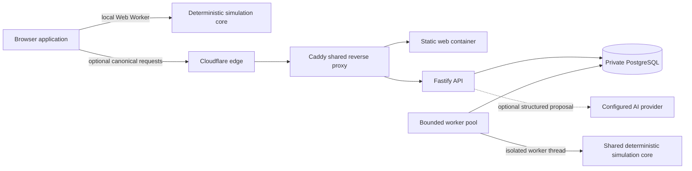

# SystemForge production architecture

SystemForge is deliberately split into a browser-local data plane and a bounded canonical control plane. The browser remains the primary place for editing and deterministic simulation. The server adds durable short links, canonical digests, and shared interview sessions without becoming a prerequisite for the core lab.

The same TypeScript simulation package runs in the Vite Web Worker and the Node worker thread. A canonical result includes a SHA-256 digest, engine version, seed, time-series metrics, causal events, and requirement results. Identical validated inputs produce identical outputs within the same engine version.

The package also exposes a bounded architecture solver. It applies explicit
parameter and operating-policy mutations, evaluates them through the same
engine, enforces caller-supplied cost and complexity ceilings, and returns a
Pareto frontier with baseline deltas. Candidate generation is limited before
simulation work is allocated. Hidden interview requirements are excluded unless
a trusted caller explicitly includes them. The current solver API is a core
engine capability; browser presentation and interaction remain a separate UI
integration concern. See `docs/engine.md` for its contract and limitations.

## Failure and overload behavior

Cloudflare absorbs the public volumetric edge and Caddy rejects direct-to-origin requests for the SystemForge hostname. The web and API are separate containers, so API or database degradation does not remove the static application shell. The installed service worker caches the application shell and immutable assets for returning browsers. It is network-first while the origin is healthy, but a network failure or origin `5xx` navigation serves the cached local lab instead of replacing it with an outage page. Ordinary client errors remain visible, and `/api/*` always bypasses the shell cache.

The browser shell uses separate browser and Cloudflare cache contracts. Browsers
must revalidate while online, while Cloudflare may keep the shell fresh for five
minutes, serve it stale during revalidation, and retain an error fallback for a
day. The policy deliberately avoids `s-maxage`, whose proxy-revalidation
semantics would prevent the stale origin-error behavior. CI also compares the
future open Caddy allowlist with Cloudflare's live published address ranges so a
range change blocks deployment rather than creating a partial outage.

The API has a one-megabyte body limit, connection/request timeouts, per-client rate limits, and transactionally enforced maximums for queued runs, durable run records, and unexpired shared scenarios. The durable ceiling evicts the oldest terminal result before new work is accepted and fails closed when active work occupies the entire budget. Canonical simulation also has a configurable work-unit ceiling based on duration and topology size, while the worker enforces a separate serialized-result byte ceiling before persistence. Together with the 250-record production default, this prevents a small request or sustained canonical traffic from amplifying into unbounded PostgreSQL storage. Canonical submissions return structured `422`, `429`, or `503` responses with `localModeAvailable: true` and `Retry-After` where appropriate. The frontend converts those states into a non-blocking service banner and leaves local editing and simulation enabled. The browser applies its own larger pre-allocation work-unit budget so a pathological but schema-valid custom model fails with guidance before a Web Worker can exhaust the tab.

Workers claim jobs with PostgreSQL `FOR UPDATE SKIP LOCKED`, use expiring leases, cap process concurrency, execute each simulation in a timeout-bounded worker thread, and retain at most three attempts. Containers have memory/CPU limits, read-only filesystems where practical, dropped Linux capabilities, log rotation, and graceful stop budgets.

CI and every approved deployment also run a production-image overload smoke.
It sends 256 concurrent requests as one synthetic visitor while fetching the
static shell 48 times, requires bounded `429` or `503` responses with retry and
local-mode guidance, checks that a separate visitor remains unaffected, and
rechecks liveness, readiness, and the local-capable shell after the burst.

## Product contracts

Guided, custom, and interview scenarios use the same versioned Zod contract. Requirements carry a metric, operator, target, visibility, and owner. Candidates can add, edit, and remove their inferred requirements before testing the architecture; edits invalidate stale local results. Interviewer links carry a high-entropy token in the URL fragment so it is not sent in HTTP request targets. Browser startup removes sensitive share and host parameters from the visible URL before React mounts and retains them only in memory long enough for the owning route to consume them. The browser forwards a server-backed interviewer token as an `Authorization: Bearer` credential, PostgreSQL stores only its SHA-256 digest, and candidate responses are filtered server-side and browser-side to remove hidden requirements and interviewer notes. A host token is retained for refresh only after the API confirms the interviewer role.

Canonical interview sessions persist a reveal state without persisting the raw
interviewer credential. `never` remains private, `after-run` reveals criteria
only after the API verifies a completed canonical run whose public scenario
matches the shared interview, and
`interviewer-controlled` changes only through a host-token-authorized route.
Local run completion cannot unlock server-held criteria. Revealing criteria
never reveals the interviewer brief. Browser-local links are static and always
omit the private rubric from candidate payloads.

Local share links use a compact, versioned, integrity-checked payload and require
no service; legacy uncompressed Base64URL links remain readable. Encoded input,
decompressed output, and worker time are bounded. Decoding and schema validation
run in a disposable worker, and invalid, empty, stale, or oversized payloads fail
closed without restoring a prior private workspace. The persistent local draft is
always the candidate-safe projection. A full interviewer draft may be retained in
tab-scoped `sessionStorage`, never `localStorage`. Architectures that exceed the
safe browser-URL budget are not emitted as broken links and must use an explicit
server-backed sharing path. Canonical links are stored for 30 days. Completed
canonical runs are retained for the configured retention period, which defaults
to 30 days.

Completed browser-local runs can enter the local Run library. Its IndexedDB
contract retains at most 24 candidate-safe records and 20 MB, expires unstarred
records after 30 days, and allows at most six starred references. A record
contains compact candidate-visible metrics and, when eligible, the existing
two-megabyte integrity-checked replay bundle. Private interview runs are not
persisted. Hidden criteria, interviewer material, credentials, collaboration,
full frames, events, traces, reports, and AI output never enter the library.
Exact reruns deduplicate by engine plus replay input and action digests; a
matching result increments its occurrence count, while a different result
digest remains separate and raises a determinism warning. Replay and per-run
export always revalidate the stored bundle before use. Labels, notes, and tags
remain local annotations and are removed from candidate-safe exports.

## Optional AI assistance boundary

AI assistance is an optional canonical-control-plane feature and is disabled by
default. The browser-local editor, deterministic simulator, solver, session
replay, and evidence exports remain complete when the feature or provider is
offline. The API creates a provider only when `SYSTEMFORGE_AI_ENABLED=true`, an
explicit model is configured, and an API-only credential is present. No provider
key, model setting, or provider URL is accepted from the browser.

The provider returns strict, versioned intent JSON rather than SystemForge
results. Requirement metrics, comparators and numeric targets must each cite
exact spans in the user's brief; deterministic server code checks semantic
aliases, parses bounded grouped and scaled literals and compatible units,
generates IDs, assigns visibility, retains unspecified authored entries,
validates the complete scenario, and returns a before/after preview. Applying
the preview remains an explicit browser action. The provider never calls the
simulation core, never returns `SimulationResult`, and cannot write drafts,
runs, collaboration records, or PostgreSQL.

Run debriefs load a completed canonical run and its retained submission inside
the API. The provider receives a bounded catalog of exact frame, objective,
analysis, event-lineage and sampled-trace facts and may select only those
evidence IDs; unknown IDs, uncited findings, and numeric AI prose fail the
request. Candidate debrief and facilitation prompts use the candidate
projection. A private rubric can enter an interviewer debrief only when the run
is semantically bound to the same shared scenario and the Bearer host credential
validates. Prompts and responses are not stored by SystemForge, but submitted
content leaves SystemForge and provider retention depends on the configured
account and data controls.

The production adapter is pinned to Cloudflare Workers AI
`@cf/meta/llama-3.1-8b-instruct-fast` through the `systemforge-production` AI
Gateway. The
API admits one provider call at a time and reserves each admitted call in
PostgreSQL before any network request. Global ceilings of 50 admitted calls per
UTC day and 500 per UTC month remain fixed in application code. Failed and
cancelled calls retain their reservation, and per-client route limits remain
stricter. For the pinned Cloudflare provider, the five-cent reservation is an
admission and audit unit rather than a claim about metered provider spend; the
Gateway's blocking $4.50 sliding 30-day cost limit is the financial fuse. Any
provider configured without that Gateway retains the separate four-dollar UTC
monthly reservation ceiling. The Gateway must also disable request/response
logging and cache and make no automatic retries. These independent controls
preserve a buffer beneath the five-dollar maximum even if abusive clients rotate
addresses.

## Availability boundary

This is a single-VPS deployment, not an active-active platform. Cloudflare, cached browser assets, and the browser-local simulator protect the core learning workflow, while canonical storage has a single PostgreSQL primary. A VPS or volume loss can interrupt canonical features until restore. Nightly verified dumps reduce local recovery time. The repository includes mode-guarded restic SFTP/S3 transfer, retention, remote integrity checking, and a disposable off-site restore drill, but those controls do not establish disaster recovery until a real independently credentialed repository is configured and its first restore passes.
