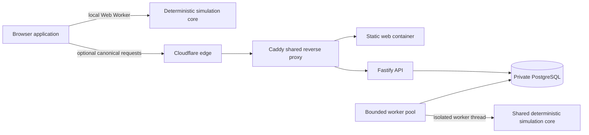

# SystemForge production architecture

SystemForge is deliberately split into a browser-local data plane and a bounded canonical control plane. The browser remains the primary place for editing and deterministic simulation. The server adds durable short links, canonical digests, and shared interview sessions without becoming a prerequisite for the core lab.

The same TypeScript simulation package runs in the Vite Web Worker and the Node worker thread. A canonical result includes a SHA-256 digest, engine version, seed, time-series metrics, causal events, and requirement results. Identical validated inputs produce identical outputs within the same engine version.

## Failure and overload behavior

Cloudflare absorbs the public volumetric edge and Caddy rejects direct-to-origin requests for the SystemForge hostname. The web and API are separate containers, so API or database degradation does not remove the static application shell. The installed service worker caches the application shell and immutable assets for returning browsers.

The API has a one-megabyte body limit, connection/request timeouts, per-client rate limits, and a transactionally enforced maximum queued-run count. Canonical submissions return structured `429` or `503` responses with `Retry-After` and `localModeAvailable: true`. The frontend converts those states into a non-blocking service banner and leaves local editing and simulation enabled.

Workers claim jobs with PostgreSQL `FOR UPDATE SKIP LOCKED`, use expiring leases, cap process concurrency, execute each simulation in a timeout-bounded worker thread, and retain at most three attempts. Containers have memory/CPU limits, read-only filesystems where practical, dropped Linux capabilities, log rotation, and graceful stop budgets.

## Product contracts

Guided, custom, and interview scenarios use the same versioned Zod contract. Requirements carry a metric, operator, target, visibility, and owner. Interviewer links include a high-entropy host token; candidate responses are filtered server-side and browser-side to remove hidden requirements and interviewer notes.

Local share links are Base64URL payloads and require no service. Canonical links are stored for 90 days. Completed canonical runs are retained for the configured retention period, which defaults to 30 days.

## Availability boundary

This is a single-VPS deployment, not an active-active platform. Cloudflare, cached browser assets, and the browser-local simulator protect the core learning workflow, while canonical storage has a single PostgreSQL primary. A VPS or volume loss can interrupt canonical features until restore. Nightly verified dumps reduce local recovery time; an encrypted off-host copy or Hetzner backup policy is required before treating server-backed user data as disaster-recoverable.
